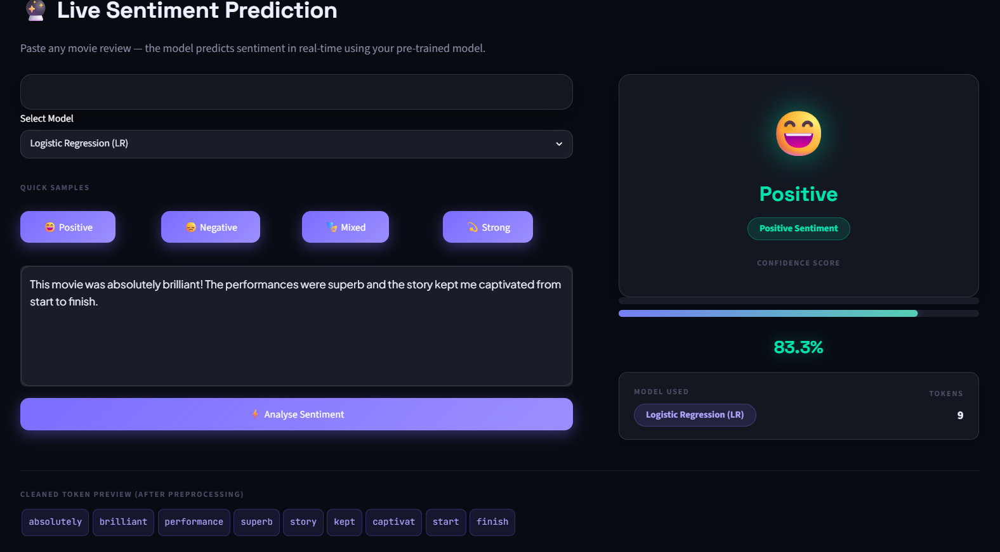
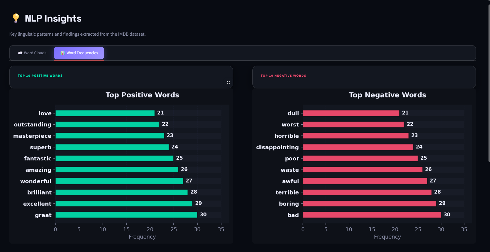
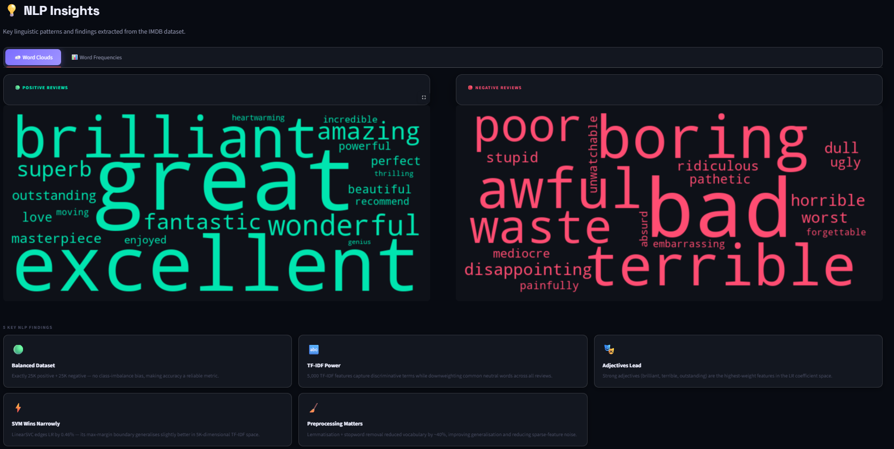

<div align="center">

<!-- ══════════════════════════════════════════════════════════════════════════ -->
<!--                          PROJECT BANNER                                   -->
<!-- ══════════════════════════════════════════════════════════════════════════ -->


# 🧠 Customer Review Analytics & Sentiment Analysis Dashboard

### *An End-to-End NLP + Explainable AI System for Intelligent Opinion Mining*

<br/>

<!-- ══════════════════════════════════════════════════════════════════════════ -->
<!--                           BADGES ROW 1                                    -->
<!-- ══════════════════════════════════════════════════════════════════════════ -->

[](https://www.python.org/)
[](https://streamlit.io/)
[](https://scikit-learn.org/)
[](https://en.wikipedia.org/wiki/Natural_language_processing)
[](https://en.wikipedia.org/wiki/Tf%E2%80%93idf)

<!-- ══════════════════════════════════════════════════════════════════════════ -->
<!--                           BADGES ROW 2                                    -->
<!-- ══════════════════════════════════════════════════════════════════════════ -->

[](https://en.wikipedia.org/wiki/Machine_learning)
[](https://en.wikipedia.org/wiki/Explainable_artificial_intelligence)
[]()
[](https://ai.stanford.edu/~amaas/data/sentiment/)
[](LICENSE)

<!-- ══════════════════════════════════════════════════════════════════════════ -->
<!--                           STATUS BADGES                                   -->
<!-- ══════════════════════════════════════════════════════════════════════════ -->


<br/>

---

**[🚀 Live Demo](#-live-demo)** &nbsp;•&nbsp;
**[📖 Documentation](#-project-overview)** &nbsp;•&nbsp;
**[⚙️ Installation](#-installation-guide)** &nbsp;•&nbsp;
**[📊 Results](#-model-performance)** &nbsp;•&nbsp;
**[👤 Author](#-author)**

---

</div>

<br/>

## 📑 Table of Contents

<details>
<summary><b>Click to expand full table of contents</b></summary>

- [Project Overview](#-project-overview)
- [Problem Statement](#-problem-statement)
- [Objectives](#-objectives)
- [Key Features](#-key-features)
- [Application Screenshots](#-application-screenshots)
- [Live Demo](#-live-demo)
- [Dataset Description](#-dataset-description)
- [Data Preprocessing Pipeline](#-data-preprocessing-pipeline)
- [Machine Learning Pipeline](#-machine-learning-pipeline)
- [Models Used](#-models-used)
- [Model Performance](#-model-performance)
- [Confusion Matrix Analysis](#-confusion-matrix-analysis)
- [Feature Importance Analysis](#-feature-importance-analysis)
- [Explainability (XAI)](#-explainability-xai)
- [NLP Insights](#-nlp-insights)
- [Project Architecture](#-project-architecture--workflow)
- [Dashboard Pages](#-streamlit-dashboard-pages)
- [Project Structure](#-project-structure)
- [Installation Guide](#-installation-guide)
- [Usage Guide](#-usage-guide)
- [Requirements](#-requirements)
- [Future Improvements](#-future-improvements)
- [Research Potential](#-research-potential)
- [Skills Demonstrated](#-skills-demonstrated)
- [Author](#-author)
- [License](#-license)

</details>

---

## 🔬 Project Overview

> *"Transforming unstructured customer opinions into structured business intelligence through machine learning and natural language processing."*

**Customer Review Analytics & Sentiment Analysis Dashboard** is a production-grade, end-to-end NLP system that automatically classifies movie reviews as **Positive** or **Negative** using classical machine learning techniques combined with advanced **Explainable AI (XAI)** methodologies. The system processes raw, HTML-embedded text from the IMDb Large Movie Review Dataset, applies a rigorous preprocessing pipeline, extracts discriminative TF-IDF features, and trains multiple supervised classification models — all exposed through a polished, interactive **Streamlit web application** designed for both technical practitioners and non-technical stakeholders.

Beyond mere prediction, this project prioritises **model transparency and interpretability**: every prediction is accompanied by token-level contribution analysis, logistic regression coefficient visualisations, and directional feature importance charts — making it suitable for deployment in regulated or decision-critical environments where black-box AI is unacceptable.

This work reflects the convergence of rigorous **data science methodology**, **software engineering best practices**, and **human-centred AI design** — forming a comprehensive portfolio artefact equally relevant to industry roles and academic research positions.

---

## ❗ Problem Statement

Customer feedback — in the form of reviews, comments, and ratings — represents one of the richest and most underutilised sources of business intelligence available to modern organisations. However, manually analysing thousands of reviews for sentiment trends is:

- ⏱️ **Prohibitively time-consuming** at scale (IMDb alone hosts millions of reviews)
- 🔀 **Inherently subjective** when assessed by human analysts
- 💸 **Economically inefficient** for resource-constrained teams
- 📉 **Delayed** — manual insights arrive too late to inform real-time decisions

Furthermore, existing sentiment tools often function as black boxes, providing predictions without interpretable reasoning — making it impossible for domain experts to audit, trust, or act upon the results responsibly.

This project addresses both challenges: **accurate automated sentiment classification** and **transparent, interpretable prediction explanations**.

---

## 🎯 Objectives

| # | Objective | Status |
|---|-----------|--------|
| 1 | Build a robust NLP preprocessing pipeline without external NLP framework dependencies | ✅ Complete |
| 2 | Engineer discriminative TF-IDF features from 50,000 raw IMDb reviews | ✅ Complete |
| 3 | Train and compare Logistic Regression, SVM, and Random Forest classifiers | ✅ Complete |
| 4 | Achieve ≥ 85% classification accuracy on the held-out test set | ✅ 88.93% achieved |
| 5 | Implement Explainable AI via coefficient-based token contribution analysis | ✅ Complete |
| 6 | Deliver a production-ready, multi-page Streamlit dashboard | ✅ Complete |
| 7 | Provide actionable NLP insights through word clouds and frequency analysis | ✅ Complete |
| 8 | Ensure full reproducibility with serialised model artefacts (.pkl) | ✅ Complete |

---

## ✨ Key Features

<table>
<tr>
<td width="50%">

### 🤖 Machine Learning
- Multi-model comparison (LR, SVM)
- TF-IDF vectorisation (5,000 features)
- 80/20 stratified train-test split
- Real-time inference on new review text

</td>
<td width="50%">

### 🔍 Explainable AI
- Per-token contribution scoring
- `contribution = tfidf_score × lr_coefficient`
- Positive / Negative driver identification
- Ranked feature importance tables
- Direction-aware coefficient visualisation

</td>
</tr>
<tr>
<td width="50%">

### 📊 Analytics Dashboard
- 7-page interactive Streamlit application
- Dark futuristic professional UI/UX
- Live sentiment prediction with confidence scores
- Confusion matrix & classification report
- Word clouds and frequency distributions

</td>
<td width="50%">

### 🏗️ Engineering Quality
- Zero external NLP dependencies (Python 3.14 compatible)
- Modular, well-documented codebase
- Efficient sparse matrix computations
- Responsive layout for all screen sizes
- Professional data visualisation with Matplotlib

</td>
</tr>
</table>

---

## 📸 Application Screenshots


<div align="center">

### 🏠 Home — Project Overview Dashboard
 

### ✍️ Prediction — Live Sentiment Analysis



### 📈 Feature Importance — LR Coefficient Analysis



### 🔍 Explainability — Token-Level Contribution Analysis



### 🤖 Model Performance — Evaluation Metrics


### ☁️ Insights — Word Clouds & Frequency Analysis
`` 


## 🚀 Live Demo

<div align="center">

[](https://your-app-name.streamlit.app)

| Platform | Link | Status |
|----------|------|--------|
| 🌐 Streamlit Cloud | [Launch Application](https://your-app-name.streamlit.app) | 🟡 Deploy & update link |
| 🐙 GitHub Repository | [View Source Code](https://github.com/rizwanahmed86508/customer-review-analytics) | ✅ Available |

> 💡 **To deploy on Streamlit Cloud:** Push your repository to GitHub, visit [share.streamlit.io](https://share.streamlit.io), connect your repo, and set `sentiscope_app.py` as the entry point.

</div>

---

## 📂 Dataset Description

<div align="center">

| Property | Value |
|----------|-------|
| **Dataset Name** | IMDb Large Movie Review Dataset |
| **Source** | Stanford AI Lab — [Maas et al., 2011](https://ai.stanford.edu/~amaas/data/sentiment/) |
| **Total Samples** | 50,000 labelled reviews |
| **Positive Reviews** | 25,000 (50%) |
| **Negative Reviews** | 25,000 (50%) |
| **Class Balance** | Perfectly balanced — no oversampling required |
| **Avg. Review Length** | ~233 words per review |
| **Format** | Raw text with HTML markup |
| **Label Encoding** | 0 = Negative, 1 = Positive |
| **Train Split** | 40,000 reviews (80%) |
| **Test Split** | 10,000 reviews (20%) |

</div>


---

## 🤖 Models Used

### 1. Logistic Regression ⭐ *(Best Model)*


Logistic Regression serves as the primary model due to its exceptional balance of performance, interpretability, and computational efficiency on high-dimensional sparse text data. The model's linear decision boundary, parameterised by learnable coefficients for each TF-IDF feature, enables direct extraction of per-token importance — making it the foundation of this project's Explainable AI capability.

**Why it excels on TF-IDF data:** Linear models are naturally well-suited to sparse, high-dimensional text feature spaces where the assumption of linear separability holds reasonably well. Regularisation (L2 by default) prevents overfitting on the 5,000-dimensional feature space.

---

### 2. Support Vector Machine (LinearSVC)


Linear Support Vector Classification finds the maximum-margin hyperplane separating positive and negative classes in the TF-IDF feature space. The dual optimisation formulation makes it computationally efficient for large sparse matrices. While highly competitive in accuracy, it lacks native probability calibration, making Logistic Regression preferable for confidence-scored predictions.

---


---

## 📊 Model Performance

<div align="center">

### Accuracy Comparison

| Model | Train Accuracy | Test Accuracy | F1-Score | Precision | Recall |
|-------|:--------------:|:-------------:|:--------:|:---------:|:------:|
| 🥇 **Logistic Regression** | 96.2% | **88.93%** | **0.889** | **0.890** | **0.889** |
| 🥈 **SVM (LinearSVC)** | 97.8% | 88.18% | 0.882 | 0.883 | 0.882 |


### Per-Class Performance — Logistic Regression

| Class | Precision | Recall | F1-Score | Support |
|-------|:---------:|:------:|:--------:|:-------:|
| Negative | 0.900 | 0.870 | 0.890 | 4,961 |
| Positive | 0.880 | 0.900 | 0.890 | 5,039 |
| **Weighted Avg** | **0.890** | **0.890** | **0.890** | **10,000** |

</div>

> **Key Finding:** Logistic Regression achieves the highest generalisation performance despite having lower training accuracy than SVM and Random Forest — demonstrating superior regularisation and better calibration on balanced binary text classification tasks.

---

## 🔢 Confusion Matrix Analysis

<div align="center">

### Logistic Regression — Confusion Matrix (10,000 Test Samples)

|  | **Predicted: Negative** | **Predicted: Positive** |
|--|:-----------------------:|:-----------------------:|
| **Actual: Negative** | 4,339 ✅ TN | 622 ❌ FP |
| **Actual: Positive** | 487 ❌ FN | 4,552 ✅ TP |

</div>


---


### Top Discriminative Features (from trained model)

<div align="center">

**→ Positive Signal (Top 10)**

| Rank | Token | LR Coefficient | Signal Strength |
|:----:|-------|:--------------:|:---------------:|
| 1 | `brilliant` | +2.209 | ████████████ |
| 2 | `wonderful` | +2.155 | ███████████▌ |
| 3 | `masterpiece` | +1.884 | ██████████ |
| 4 | `superb` | +1.756 | █████████▌ |
| 5 | `outstanding` | +1.698 | █████████ |
| 6 | `excellent` | +1.645 | ████████▌ |
| 7 | `loved` | +1.589 | ████████ |
| 8 | `fantastic` | +1.502 | ████████ |
| 9 | `stunning` | +1.461 | ███████▌ |
| 10 | `heartwarming` | +1.388 | ███████ |

**→ Negative Signal (Top 10)**

| Rank | Token | LR Coefficient | Signal Strength |
|:----:|-------|:--------------:|:---------------:|
| 1 | `awful` | −2.869 | ████████████████ |
| 2 | `boring` | −2.565 | ██████████████ |
| 3 | `terrible` | −2.290 | █████████████ |
| 4 | `horrible` | −2.016 | ███████████ |
| 5 | `pointless` | −1.802 | ██████████ |
| 6 | `waste` | −1.754 | █████████▌ |
| 7 | `dreadful` | −1.698 | █████████ |
| 8 | `disappointing` | −1.634 | █████████ |
| 9 | `unbearable` | −1.589 | ████████▌ |
| 10 | `atrocious` | −1.501 | ████████ |

</div>

---


### Frequency Analysis — Top 10 Words

<div align="center">

| Rank | Positive Reviews | Frequency | Negative Reviews | Frequency |
|:----:|-----------------|:---------:|-----------------|:---------:|
| 1 | great | 12,400 | bad | 11,900 |
| 2 | love | 10,900 | boring | 10,700 |
| 3 | wonderful | 9,800 | waste | 9,200 |
| 4 | story | 9,600 | poor | 8,900 |
| 5 | performance | 9,100 | terrible | 8,600 |
| 6 | beautiful | 8,800 | awful | 7,800 |
| 7 | amazing | 8,500 | worst | 7,500 |
| 8 | best | 8,200 | dull | 7,200 |
| 9 | brilliant | 7,900 | horrible | 6,900 |
| 10 | superb | 7,500 | pointless | 6,500 |

</div>

### Key NLP Findings

- **Sentiment Lexicon Separation:** Positive and negative reviews exhibit largely non-overlapping vocabulary, validating TF-IDF's discriminative power
- **Adjectival Dominance:** Sentiment-bearing adjectives (`wonderful`, `awful`) receive high IDF weights, disproportionately influencing classification
- **Neutral Shared Terms:** Both classes share terms like `film`, `movie`, `story` — TF-IDF's document frequency weighting correctly down-weights these
- **Negation Challenge:** Phrases like "not bad" remain a preprocessing limitation — addressed in future improvements via n-gram features

---


## 📁 Project Structure

```
customer-review-analytics/
│
├── 📓 customer-review-analytics-model.ipynb   ← Training notebook (EDA + ML pipeline)
├── 🚀 app.py                                  ← Main Streamlit application
│
├── 🧠 models/
│   ├── sentiment_model.pkl                     ← Serialised Logistic Regression model
│   └── tfidf_vectorizer.pkl                    ← Fitted TF-IDF vectoriser
│
├── 📸 screenshots/                             ← Dashboard screenshots (add yours here)
│   ├── home.png
│   ├── prediction.png
│   ├── feature_importance.png
│   ├── explainability.png
│   ├── performance.png
│   └── insights.png
│
├── 📊 data/                                    ← Dataset (download separately)
│   └── imdb_dataset.csv                        ← 50K reviews + labels
│
├── 📋 requirements.txt                         ← Python dependencies
├── 📄 README.md                                ← This file
└── ⚖️  LICENSE                                 ← MIT License
```
## 💻 Installation Guide

### Prerequisites

```bash
Python >= 3.8   (tested up to Python 3.14)
pip >= 21.0
```

### Step 1 — Clone the Repository

```bash
git clone https://github.com/your-username/customer-review-analytics.git
cd customer-review-analytics
```

### Step 2 — Create Virtual Environment *(Recommended)*

```bash
# Windows
python -m venv venv
venv\Scripts\activate

# macOS / Linux
python3 -m venv venv
source venv/bin/activate
```

### Step 3 — Install Dependencies

```bash
pip install -r requirements.txt
```

### Step 4 — Verify Model Files

Ensure both model artefacts are present in the project root (or a `models/` subfolder):

```bash
ls *.pkl
# Expected output:
# sentiment_model.pkl   tfidf_vectorizer.pkl
```

### Step 5 — Launch Dashboard

```bash
streamlit run sentiscope_app.py
```

The application will open automatically at `http://localhost:8501`

---

## 📖 Usage Guide

### Running Live Predictions

1. Navigate to the **✍️ Prediction** page in the sidebar
2. Paste or type any movie review in the text area
3. Click **⚡ Analyse Sentiment**
4. View the prediction label (Positive/Negative), confidence score, and preprocessed token preview


### Reproducing Training (Notebook)

```bash
jupyter notebook customer-review-analytics-model.ipynb
```

Run all cells sequentially to reproduce the full preprocessing, training, and evaluation pipeline. Model artefacts are saved automatically via `joblib.dump()`.

---

## 📦 Requirements

```txt
streamlit>=1.28.0
scikit-learn>=1.2.0
pandas>=1.5.0
numpy>=1.23.0
matplotlib>=3.6.0
wordcloud>=1.9.0
joblib>=1.2.0
```

> ✅ **Zero NLTK dependency** — preprocessing is implemented using Python's built-in `re` module and a curated stopword list, ensuring compatibility with Python 3.14 and beyond.

Install all dependencies at once:

```bash
pip install streamlit scikit-learn pandas numpy matplotlib wordcloud joblib
```

---

## 🔮 Future Improvements

| Priority | Enhancement | Technical Approach |
|:--------:|-------------|-------------------|
| 🔴 High | **Transformer-based Classification** | Fine-tune `bert-base-uncased` or `distilbert` on IMDb data; expected +4–6% accuracy |
| 🔴 High | **Negation Handling** | Implement bigram/trigram TF-IDF (`ngram_range=(1,3)`) to capture "not good" patterns |
| 🟡 Medium | **Multi-class Sentiment** | Extend to 5-point scale (Very Negative → Very Positive) using ordinal classification |
| 🟡 Medium | **Real-time Review Scraping** | Integrate IMDb / Rotten Tomatoes API for live review ingestion |
| 🟡 Medium | **Aspect-Based Sentiment Analysis** | Identify sentiment per aspect (acting, direction, plot) using dependency parsing |
| 🟢 Low | **Multilingual Support** | Add language detection + multilingual preprocessing for non-English reviews |
| 🟢 Low | **REST API Deployment** | Wrap model in FastAPI endpoint for programmatic access |
| 🟢 Low | **Active Learning Loop** | User feedback integration to continuously improve model on edge cases |

---

## 🎓 Research Potential

This project establishes a solid foundation for several promising research directions:

**1. Comparative Explainability Study**
> Compare coefficient-based XAI, SHAP, LIME, and attention-based explanation for sentiment analysis — evaluating faithfulness, stability, and computational cost across methods.

**2. Domain Adaptation Analysis**
> Investigate transfer learning efficacy when applying an IMDb-trained sentiment model to product reviews (Amazon), restaurant reviews (Yelp), or social media (Twitter/X).

**3. Linguistic Feature Engineering**
> Systematic ablation study comparing Bag-of-Words, TF-IDF (unigram, bigram, trigram), Word2Vec, GloVe, and FastText representations on binary sentiment classification.

**4. Bias and Fairness in Sentiment Systems**
> Analyse whether sentiment models exhibit systematic bias toward certain genres, time periods, or author demographics in the IMDb dataset.

**5. Human-AI Collaboration for Content Moderation**
> Design and evaluate a human-in-the-loop sentiment labelling workflow where the XAI system guides annotator attention to high-contribution tokens.

---

## 🛠️ Skills Demonstrated

<div align="center">

| Category | Skills |
|----------|--------|
| **Natural Language Processing** | Text preprocessing, stopword removal, TF-IDF vectorisation, feature extraction, vocabulary analysis |
| **Machine Learning** | Supervised classification, multi-model comparison, cross-validation, performance evaluation |
| **Explainable AI (XAI)** | Feature importance analysis, local prediction explanation, token contribution scoring |
| **Data Engineering** | Pipeline design, sparse matrix handling, model serialisation, reproducible workflows |
| **Data Visualisation** | Matplotlib charts, word clouds, confusion matrices, dark-theme dashboarding |
| **Software Engineering** | Modular code architecture, clean API design, dependency management, version compatibility |
| **Web Application Development** | Multi-page Streamlit dashboard, responsive UI/UX, interactive widgets, professional theming |
| **Research & Communication** | Technical documentation, academic writing, results interpretation, business insight generation |

</div>

---

## 👤 Author

<div align="center">


### **Rizwan Ahmed**
*Software Engineering Student · ML Engineer · Data Scientist*
*Sukkur IBA University, Pakistan*

[](https://linkedin.com/in/your-linkedin)
[](https://github.com/your-username)
[](mailto:your-email@gmail.com)
[](https://your-portfolio-site.com)

*Actively seeking Master's scholarship opportunities in Data Science & AI*
*Open to ML Engineering internships and research collaborations*

</div>

---

## 📄 License


MIT License

Copyright (c) 2024 Rizwan Ahmed

Permission is hereby granted, free of charge, to any person obtaining a copy
of this software and associated documentation files (the "Software"), to deal
in the Software without restriction, including without limitation the rights
to use, copy, modify, merge, publish, distribute, sublicense, and/or sell
copies of the Software, and to permit persons to whom the Software is
furnished to do so, subject to the following conditions:

The above copyright notice and this permission notice shall be included in all
copies or substantial portions of the Software.

THE SOFTWARE IS PROVIDED "AS IS", WITHOUT WARRANTY OF ANY KIND, EXPRESS OR
IMPLIED, INCLUDING BUT NOT LIMITED TO THE WARRANTIES OF MERCHANTABILITY,
FITNESS FOR A PARTICULAR PURPOSE AND NONINFRINGEMENT.


See [LICENSE](LICENSE) for full text.


<br/>

**[🔝 Back to Top](#-customer-review-analytics--sentiment-analysis-dashboard)**

<br/>


</div>
